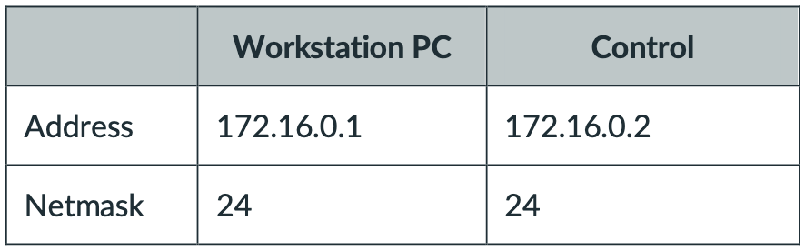

# ROBOT 6000 Lab Setup Guide

In this repo and document, it is explained how to set up the FRANKA Erica Research 3 robots for the labs. There are also provided shell scripts to ease the process.

The only thing that needs to happen before starting this document is ensuring the machine you are using is running Ubuntu Pro. We _must_ have Ubunut Pro as it includes a realtime kernel that will be needed later on

> Ubuntu 24.04.1 LTS was used for this tutorial, with Pro installed

> FRANKA Manual found [here](https://www.franka.de/hubfs/Product%20Manual%20Franka%20Research%203_R02210_1.5_EN-1.pdf?hsLang=en){:target="_blank" rel="noopener"}
> FCI Documentation found [here](https://frankarobotics.github.io/docs/franka_ros2.html){:target="_blank" rel="noopener"}

---

# 1. Install Required Software

First things that needs to happen is to download all the software that will be needed throughout this tutorial (and labs later on)

## Pre-git

1. Ubuntu Pro
2. VSCode (from the SNAP store) (just "code" in the store)
3. Chrome (from browser)
   > This is needed for FRANKA Desk later
4. Neovim (or vim)
   ```bash
   sudo apt install neovim
   ```
5. Git
   ```bash
   sudo apt update
   sudo apt install git
   git config --global user.name "mek1156"
   git config --global user.email "labStation@robot6000.uofu"
   ```

Setup the SSH key so you can access git/github

```bash
cd ./.ssh
ssh-keygen -t ed25519 -C "labStation@robot6000.uofu"
cat ~/.ssh/id_ed25519.pub
```

Add the SSH key to you github account, the move to desired folder and create the repo locally

```bash
mkdir -p ~/Documents/robot6000
cd ~/Documents/robot6000
git clone git@github.com:jawy1248/robot6000.git
cd robot6000
```

Now you should have this repository downloaded and continue with the next steps

## Post-git

6. Docker

   ```bash
   chmod +x scripts/installDocker.sh
   ./scripts/installDocker.sh
   ```

   ```bash
   sudo groupadd docker
   ```

   ```bash
   sudo usermod -aG docker $USER
   ```

   ```bash
   newgrp docker
   ```

   > If you run `docker run hello-world`, you should see a "Hello from Docker"

---

# 2. FRANKA Setup

Now that all the required softwares are installed, we will move on to setting up the FRANKA Erica Research 3 Robot

1. Download the FRANKA ROS2 packages
   ```bash
   cd ~/Documents/robot6000
   git clone git@github.com:frankarobotics/franka_ros2.git
   ```
2. Setup the FRANKA on FRANKA Desk
   1. Turn on the FRANKA (via the control box, on the back)
   2. Ensure the X5 port is connected to the computer via ethernet. This port is found **on the robot**, not on the control box
   3. Open **Chrome** and type in the url `robot.franka.de`
   4. Do the "First Start" reqirements
   5. Setup the admin, safety, and student profiles
3. Setup static IP addresses for control via FCI
   1. Linux machine (_Workstation PC_)
   2. FRANKA Desk (_Control_)
      
4. Start the realtime-kernel

   ```bash
   sudo apt install ubuntu-pro-client
   sudo pro enable realtime-kernel
   ```

   > This is where the Ubuntu Pro is required

   Next, you will have to reboot the machine for the effects to take place. After reboot, you can check you are on the correct kernel with `uname -a`. It should contain the strings `realtime` and `PREEMPT_RT`. Additionally, if you `cat /sys/kernel/realtime` the number `1` should be output.

5. Setup config docs for kernel
   ```bash
   sudo addgroup realtime
   sudo usermod -a -G realtime $(whoami)
   sudo nvim /etc/security/limits.conf
   ```
   This will open a neovim editor where you need to add the following lines
   ```conf
   @realtime soft rtprio 99
   @realtime soft priority 99
   @realtime soft memlock 102400
   @realtime hard rtprio 99
   @realtime hard priority 99
   @realtime hard memlock 102400
   ```
   > Close neovim with `esc` -> `:` -> `wq` -> `enter`  
   > You will then need to reboot once more (via GUI or `reboot` in CLI)

---

# 3. FRANKA Control via FCI

We are now to the part of actually controlling the FRANKA via FCI!

1. Open FRANKA Desk, unlock the joints, and allow for FCI control
2. Open the provide dockerized ros2ws from FRANKA

   > If this is your first time running this, and have to build the container, run this command

   ```bash
   chmod +x scripts/run_franka.sh
   ./scripts/run_franka.sh
   ```

   > If the container is already build, you can run this command to save time

   ```bash
   chmod +x scripts/run_franka.sh
   ./scripts/run_franka.sh -n
   ```

   If this fails with error code 100, then you need to run the following commands to give docker enginer DNS access

   ```bash
   sudo mkdir -p /etc/docker
   echo '{"dns": ["8.8.8.8","1.1.1.1"]}' | sudo tee /etc/docker/daemon.json
   sudo systemctl restart docker
   ```

   Then rerun

   ```bash
   ./scripts/run_franka.sh
   ```

   Once the ros2ws is active, run the following commands

   ```bash
   vcs import src < src/franka.repos --recursive --skip-existing
   ```

   ```bash
   source install/setup.bash
   ```

   > If you hake any changes to files in `ros2_ws > src`, then you will have to run:

   ```bash
   colcon build
   ```

   > After finishing the session, use this command to close the docker daemon

   ```bash
   cd ../franka_ros2 && docker compose down -t 0 && cd ../robot6000
   ```

   > Sometimes (unsure why still), you have to run the `colcon build` command above a second time, if `libfranka` has failed, usually it just simply works on the seconds build

3. Next, you need to change `config.yaml` file to update the IP address of the robot to the static IP address `172.16.0.2`. This file is found at `robot6000 > franka_ros2 > franka_bringup > conifg`

4. Test your build. In the ros2_ws, run the command
   > For R-Viz
   > When in the Docker container, run `xhost +local:docker` so the container has access to mointor/graphics information
   ```bash
   ros2 launch franka_fr3_moveit_config moveit.launch.py robot_ip:=dont-care use_fake_hardware:=true
   ```
   > For Moving Robot
   ```bash
   ros2 launch franka_bringup example.launch.py controller_name:=move_to_start_example_controller
   ```
