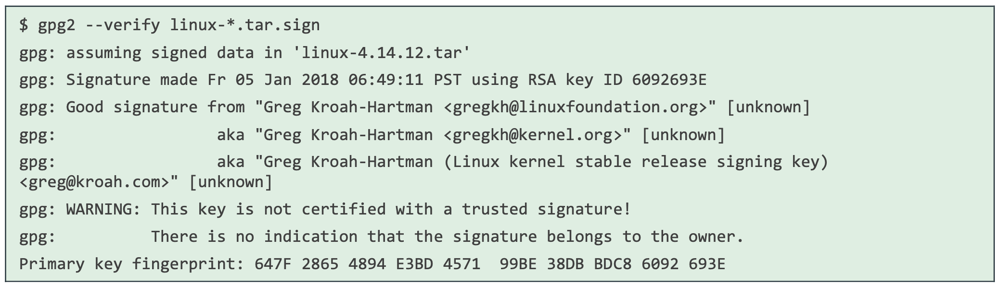
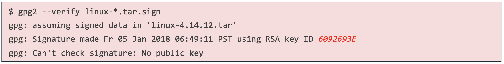

# Installation of RT Kernel for FCI

## 1. First, it is necessary to create a folder to run the following commands (I named it `rt_kernel`)

## 2. Install the necessary dependencies
```bash
sudo apt-get install build-essential bc curl ca-certificates gnupg2 libssl-dev lsb-release libelf-dev bison flex dwarves zstd libncurses-dev
```

## 3. Determine the kernel version you will be using. Find your current version with the command
```bash
uname -r
```

## 4. Download the source files
```bash
curl -SLO https://www.kernel.org/pub/linux/kernel/v5.x/linux-5.9.1.tar.xz
curl -SLO https://www.kernel.org/pub/linux/kernel/v5.x/linux-5.9.1.tar.sign
curl -SLO https://www.kernel.org/pub/linux/kernel/projects/rt/5.9/patch-5.9.1-rt20.patch.xz
curl -SLO https://www.kernel.org/pub/linux/kernel/projects/rt/5.9/patch-5.9.1-rt20.patch.sign
```
Then decompress those files
```bash
xz -d *.xz
```

## 5. Next, verify the installation
> Run these commands one at a time, not together
```bash
gpg2 --verify linux-*.tar.sign
gpg2 --verify patch-*.patch.sign
```

You will get one of two responses for both of the checks

> **Make sure to check both the `linux` and the `patch` file...following the same process for both cases**

Option 1) 
Option 2) 

If you get Option 1, you are good to go. If you get Option 2, you will have to download a key. Do so with the following command
```bash
gpg2 --keyserver hkp://keyserver.ubuntu.com:80 --recv-keys <RSA_keyID_from_err_msg>
```
> The RSA Key ID is shown in RED in the Option 2 image

## 6. Next, we need to compile the Kernel, to do this run the following commands
> Run each of them seperately, not all together
```bash
tar xf linux-*.tar
cd linux-*/
patch -p1 < ../patch-*.patch
```
After this is ran, some configuration of the kernels need to be done for booting. This is done with the following
```bash
cp -v /boot/config-$(uname -r) .config
```
Now we can make this the default
> The second command, `make menuconfig`, will take you to a secondary screen, this is good!
```bash
make olddefconfig
make menuconfig
```

## 7. TUI
> **These are taken directly from the FRANKA manual**
1. Navigate with the up/down keys to "General Setup" > "Preemption Model" and mark there > "Fully Preemptible Kernel (Real-Time)" By using the side arrow keys you can move the cursor to Select in the command line at the bottom of the screen. Now press <Enter> and the selection is chosen.
2. Set the cursor in the command line to <EXIT> and press <Enter> repeatedly until you return to the main menu.
3. Now navigate to "Cryptographic API" > "Certificates for signature checking" (at the very bottom of the list) > "Provide system-wide ring of trusted keys".
4. There, select "Additional X.509 keys for default system keyring" and press Enter. An input window opens. Remove the entry "debian/canonical-certs.pem" from the prompt and press Ok.
5. Now navigate to "Cryptographic API" > "Certificates for signature checking" (at the very bottom of the list) > "Provide system-wide ring of revocation certificates".
6. There select "X.509 Certfifcates tob e preloaded into the system blacklist keyring" and press Enter. An input window opens. There remove the entry "debian/canonical-revoked-certs.pem" from the prompt and press Ok.
7. Save this now the configuration in .config and exit the terminal interface (TUI).
> **Depending on the Kernel and TUI, Steps 5-7 are automatically done when doing steps 3-4. At the bottom on the same screen, just make sure the blacklisted hashes is empty**

---

# ENDED ON PAGE 109 OF FRANKA MANUAL 